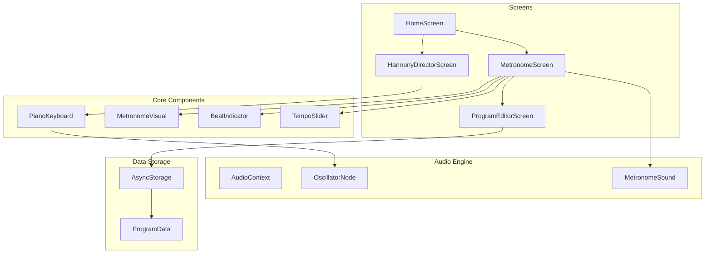

# 合奏支援アプリ開発計画

## アーキテクチャ概要



## 技術スタック

| カテゴリ | 技術 | 用途 |

|---------|------|------|

| フレームワーク | Expo (React Native) | クロスプラットフォーム開発 |

| 音声合成 | react-native-audio-api | Web Audio API準拠の音声生成 |

| ナビゲーション | expo-router | 画面遷移管理 |

| 状態管理 | Zustand | グローバル状態管理 |

| データ保存 | @react-native-async-storage | プログラム設定の永続化 |

| UI | React Native + カスタムコンポーネント | モダンUI |

## 主要機能

### 1. メトロノーム機能

- テンポ設定（20-300 BPM）
- 拍子設定（2/4, 3/4, 4/4, 5/4, 6/8 など）
- 視覚的なビート表示（振り子アニメーション + 拍インジケーター）
- アクセント設定
- タップテンポ機能

### 2. プログラムメトロノーム

- 複数セクションの設定（テンポ、拍子、小節数）
- セクション間の自動遷移
- プログラムの保存・読み込み・編集
- 現在位置のリアルタイム表示

### 3. ハーモニー

- 2オクターブ表示のピアノ鍵盤
- 音域移動ボタン（C1〜C7の範囲）
- 音律切り替え（平均律 / 純正律）
- ピュアトーン（サイン波）の再生
- 基準ピッチ設定（A=440Hz を中心に調整可能）
- マルチタッチ対応（和音演奏）

## ディレクトリ構成

```
my-expo-app/
├── app/
│   ├── _layout.tsx          # ルートレイアウト
│   ├── index.tsx            # ホーム画面
│   ├── metronome.tsx        # メトロノーム画面
│   ├── harmony.tsx          # ハーモニー画面
│   └── program/
│       ├── index.tsx        # プログラム一覧
│       └── [id].tsx         # プログラム編集
├── components/
│   ├── ui/                  # 共通UIコンポーネント
│   ├── metronome/           # メトロノーム関連
│   └── harmony/             # ハーモニー関連
├── hooks/
│   ├── useAudioEngine.ts    # 音声エンジン
│   ├── useMetronome.ts      # メトロノームロジック
│   └── usePitchCalculator.ts # 音律計算
├── stores/
│   └── useAppStore.ts       # Zustand ストア
├── utils/
│   ├── pitchUtils.ts        # 周波数計算（平均律・純正律）
│   └── programUtils.ts      # プログラムデータ操作
└── types/
    └── index.ts             # 型定義
```

## UI/UXデザイン方針

- **カラースキーム**: ダークモードベース（演奏中の視認性重視）
- **アクセントカラー**: ゴールド/アンバー系（高級感）
- **フォント**: 数値は読みやすいモノスペース
- **アニメーション**: 滑らかな振り子、拍子のパルス
- **レイアウト**: 大きなタッチターゲット、片手操作対応

## 音律計算式

### 平均律

```
frequency = baseFreq × 2^(semitones/12)
```

### 純正律（主要な音程比）

- ユニゾン: 1/1
- 長2度: 9/8
- 長3度: 5/4
- 完全4度: 4/3
- 完全5度: 3/2
- 長6度: 5/3
- 長7度: 15/8
- オクターブ: 2/1

## 実装の優先順位

1. プロジェクト構成とナビゲーション設定
2. 音声エンジンの実装（react-native-audio-api）
3. 基本メトロノーム機能
4. ハーモニー（鍵盤UI + 音声再生）
5. プログラムメトロノーム機能
6. データ永続化（保存・読み込み）
7. UI/UXのブラッシュアップ